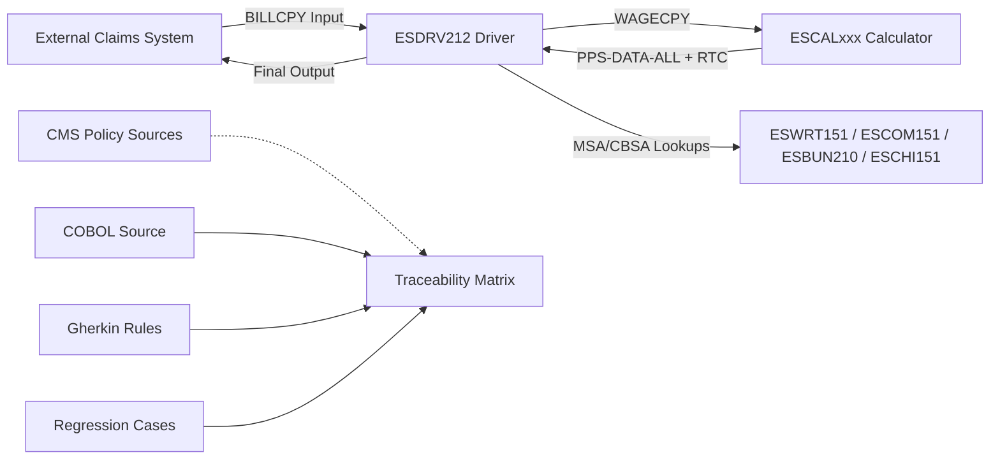
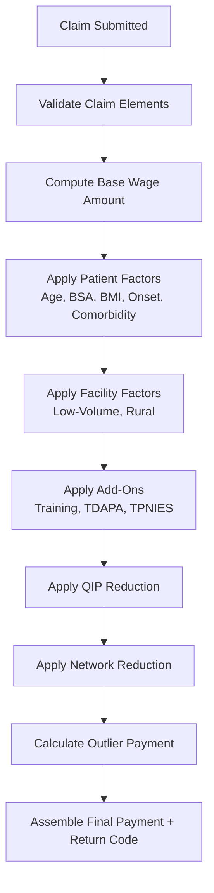
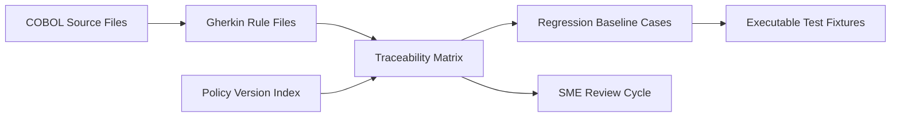

# Architecture Diagrams (New)

This document adds new diagrams to complement `docs/diagrams/system_architecture.md`. All diagrams use Mermaid for easy rendering.

## 1) System Context and Data Flow



## 2) Pricing Pipeline (Business View)



## 3) Wage Index Resolution Path

```mermaid
flowchart TD
    WageStart[Wage Index Needed] --> Special[Special Payment Indicator?]
    Special -- Yes --> SpecWI[Use Provider-Supplied Wage Index]
    Special -- No --> Child[Children's Hospital Override?]
    Child -- Yes --> ChildWI[Use Children’s Hospital Override Index]
    Child -- No --> CBSA[Lookup CBSA Wage Index]
    CBSA --> Cap[Apply 5% Decrease Cap (if enabled)]
    Cap --> WageDone[Wage Index Selected]
```

## 4) Rule Governance and Traceability


