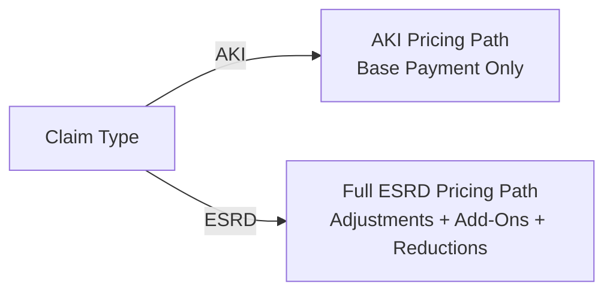
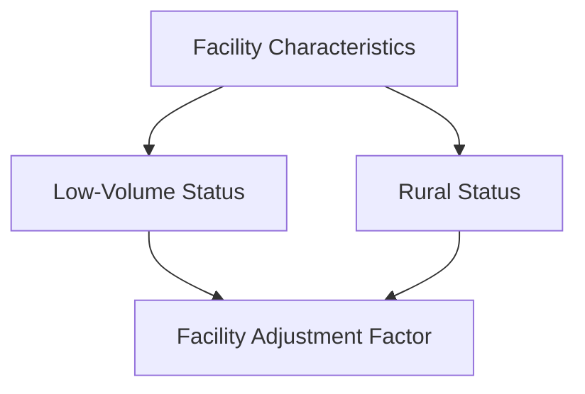

# Domain-Expert Diagrams (Business View)

These diagrams are written for policy and claims SMEs. They avoid program or code references and describe the pricing logic in business terms.

## 1) Claim Pricing Overview

```mermaid
flowchart TD
    A[Dialysis Claim Submitted] --> B[Check Basic Claim Validity]
    B --> C[Identify Claim Type<br/>(ESRD vs AKI)]
    C --> D[Determine Geographic Wage Index]
    D --> E[Calculate Base Payment]
    E --> F[Apply Patient-Level Adjustments<br/>(Age, BSA, BMI, Onset, Comorbidities)]
    F --> G[Apply Facility-Level Adjustments<br/>(Low-Volume, Rural)]
    G --> H[Apply Add-On Payments<br/>(Training, TDAPA, TPNIES)]
    H --> I[Apply Quality Incentive Reduction (QIP)]
    I --> J[Apply ESRD Network Reduction]
    J --> K[Calculate Outlier Payment (if eligible)]
    K --> L[Finalize Payment + Return Code]
```

## 2) Wage Index Determination (Business Rules)

```mermaid
flowchart TD
    A[Facility Location Identified] --> B[Standard Wage Index Lookup<br/>(CBSA/County)]
    B --> C{Special Wage Index Applies?}
    C -- Yes --> D[Use Special Wage Index]
    C -- No --> E[Apply Standard Wage Index]
    E --> F{Wage Index Decrease Cap Enabled?}
    F -- Yes --> G[Limit Decrease to 5%]
    F -- No --> H[Use Calculated Wage Index]
    G --> H
```

## 3) AKI vs ESRD Pricing Paths



## 4) Patient-Level Adjustments

```mermaid
flowchart TD
    A[Patient Characteristics] --> B[Age Category]
    A --> C[Body Surface Area (BSA)]
    A --> D[Body Mass Index (BMI)]
    A --> E[Dialysis Onset (<=120 days)]
    A --> F[Comorbidities (Single Highest)]
    B --> G[Patient-Level Adjustment Factor]
    C --> G
    D --> G
    E --> G
    F --> G
```

## 5) Facility-Level Adjustments


